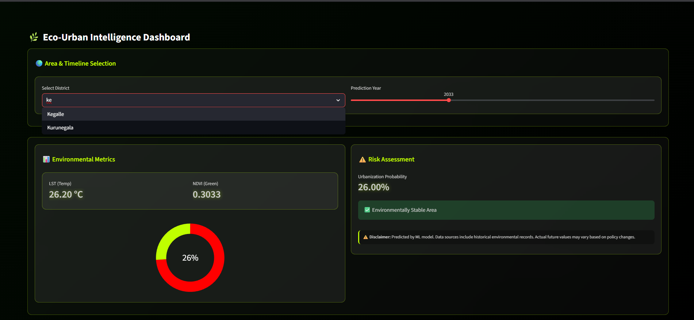
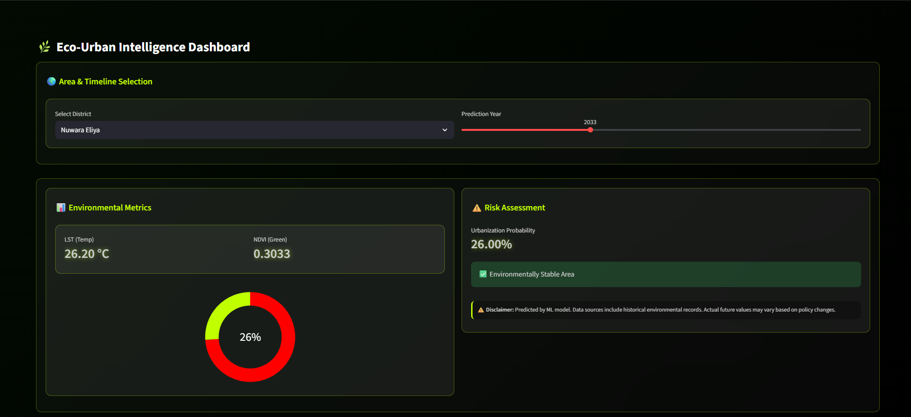
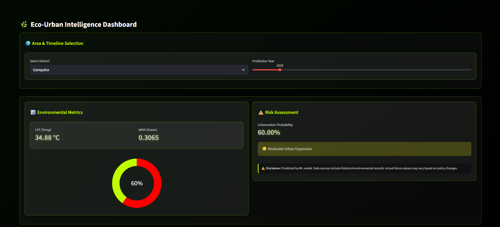
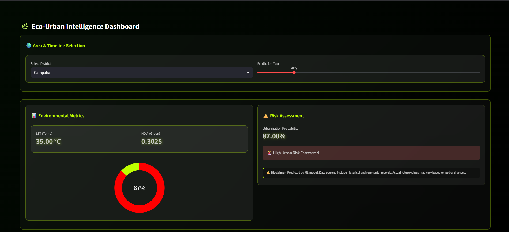

# 🌍 Eco-Urban Intelligence: Sprawl Monitoring in Sri Lanka

An Advanced Machine Learning Dashboard to monitor, forecast, and visualize Urban Sprawl and environmental degradation across Sri Lankan districts using Satellite Imagery and Socio-Demographic data.

---

## 📌 Project Overview
Urban sprawl in Sri Lanka is transforming green landscapes into heat-retaining concrete zones. This project leverages **Random Forest Regressors** and **Classifiers** to predict future Land Surface Temperature (LST), Vegetation Index (NDVI), and Urbanization Risks up to the year 2050.


*Figure 1: Eco-Urban Intelligence Dashboard - District Selection & Prediction Interface*

---

## 🛠️ Key Features
- **Temporal Forecasting:** Predicts LST, NDVI, and Population based on historical trends (2015-2024).
- **Risk Assessment:** Categorizes districts into Stable, Moderate, or High-Risk zones using a probabilistic ML model.
- **Interactive UI:** Built with Streamlit for intuitive district-level exploration.
- **Data-Driven Insights:** Integrated data from Google Earth Engine (Landsat 8-9) and local census records.

---

## 📊 Risk Intelligence Examples

The dashboard provides real-time risk assessments based on machine learning predictions. Below are the three primary risk states:

| **Environmentally Stable** | **Moderate Urban Expansion** | **High Urban Risk Forecasted** |
|:---:|:---:|:---:|
|  |  |  |
| Low urbanization probability with high vegetation retention. | Noticeable shifts in land use and rising surface temperatures. | Critical urbanization levels requiring immediate urban planning. |

---

## 📊 Technical Architecture
1. **Data Sourcing:** Harvested via Google Earth Engine (LST, NDVI, NDBI).
2. **Preprocessing:** Feature scaling, mean imputation, and label encoding.
3. **Modeling:** - **Regressor:** Multi-output Random Forest for trend forecasting.
   - **Classifier:** Random Forest for urbanization risk grading.
4. **Deployment:** Hosted on Streamlit Community Cloud.

## 🚀 Getting Started

### 1. Prerequisites
Make sure you have Python installed. Then, clone this repository:
```bash
git clone [https://github.com/navodniwarshana/sprawl-monitoring-sl.git](https://github.com/navodniwarshana/sprawl-monitoring-sl.git)
cd sprawl-monitoring-sl
